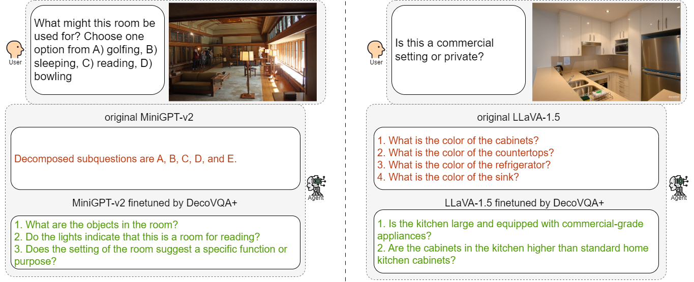

# Visual-Question-Decomposition
Code for EMNLP 2024 Findings paper "Visual Question Decomposition on Multimodal Large Language Models"

<p align="center">

</p>

## Installation
We do finetuning and inference with four open-source Multimodal Large Language Models (MLLMs). You can easily download the source code and finish the conda environment setup accordingly in the GitHub repository links as follows:
| Model | GitHub Link |
|-----------|---------|
| MiniGPT-v2 | [repo link](https://github.com/Vision-CAIR/MiniGPT-4) |
| LLaVA-1.5  | [repo link](https://github.com/haotian-liu/LLaVA) |
| Qwen-VL-Chat | [repo link](https://github.com/QwenLM/Qwen-VL) |
| InternVL-Chat-V1-5 | [repo link](https://github.com/OpenGVLab/InternVL) |

## Data Preparation
Both finetuning and inference require [COCO images](https://cocodataset.org/#download), we use the 2017 version. Unzip train2017.zip under [data/finetuning/finetuning_COCO_images/](data/finetuning/finetuning_COCO_images/) and test2017.zip under [data/inference/inference_COCO_images/](data/inference/inference_COCO_images/).

If you would like to do inference on GQA dataset, [GQA images](https://cs.stanford.edu/people/dorarad/gqa/download.html) are required additionally. Unzip images.zip under [images/inference_GQA_images/](data/inference/inference_GQA_images/).


## Fintuning
If you would like to finetune models on your own, please follow [the finetuning instruction](finetuning/finetuning_instruction.md).

You can also directly download our finetuned checkpoints for these four MLLMs in [Finetuned Model Zoo](finetuning/Finetuned_Model_Zoo.md).


## Inference
### 1. VQD Task

### 2. VQA Task

### 3. Whether2Deco Task

## Evaluation
### 1. Quality of Sub-questions: SubQuestRater Evaluation Framework

### 2. VQA Accuracy

### 3. Whether2Deco Accuracy


## Contact
For any issue or question, kindly contact us per E-Mail: Haowei Zhang (haowei.zhang@tum.de)

## Acknowledgement
The code is partly based on the following repos, thank so much to all the contributors!

[MiniGPT-4](https://github.com/Vision-CAIR/MiniGPT-4)
[LLaVA](https://github.com/haotian-liu/LLaVA)
[Qwen-VL](https://github.com/QwenLM/Qwen-VL)
[InternVL](https://github.com/OpenGVLab/InternVL)

## Citation

If you find this work useful, please consider giving this repository a star and citing our paper:

```
example paper
```
